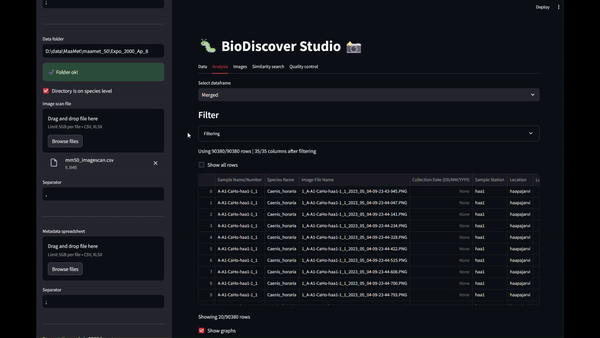

# Taxonomist Studio

Taxonomist Studio is a visualization and analysis application and a library that makes it easier to work with image data collected in species identification workflows. Taxonomist-studio works especially well with the BioDiscover device, and has useful tools that extend the functionality of the [Biodiscover SRS software](https://github.com/Aarhus-University-MPE/BioDiscover/).




# Features
- Dataset analysis and visualization with a web interface
- Similarity search for images
- Outlier detection using feature vectors
- Image segmentation and feature extraction
- Automatic pasting of metadata from excel to SRS
- Automatic pasting of plate positions for MegaBarcoding workflows

> [!WARNING]
> Taxonomist Studio is still under development and functionality might still change at any time.

# Installation

## Git

Clone the repository

```bash
git clone https://github.com/mikkoim/biodiscover-studio.git
```
## Conda
Install Miniforge following the [installation instructions](https://github.com/conda-forge/miniforge?tab=readme-ov-file#install), and navigate to the repository root folder ```biodiscover-studio```.
<details>
<summary>Windows</summary>

---
On Windows, once Conda is installed, you should have the program "Miniforge Prompt" in your start menu. Opening the application opens a command line window

```cmd
(base) C:\>
```

where you can use the ```cd``` command to navigate to the repository location. Remember that on Windows, you can change the drive by writing the drive name and pressing Enter:

```cmd
(base) C:\>d:
(base) D:\>
```

Navigate to the correct folder:
```cmd
(base) D:\>cd D:\your_path\biodiscover-studio
(base) D:\your_path\biodiscover-studio>
```

where you can apply the Conda commands in the next steps.

---
</details>
<br>


The environment is created from the ```environment.yaml```-file with commands
```bash
mamba env create -f environment.yaml
```
Creating the environment can take a while depending on your internet speed.  

Finally, you can activate the environment with command
```bash
mamba activate taxonomist-studio
```

The environment is installed and activated successfully if your anaconda prompt starts with ```(taxonomist-studio)```

### Updating the environment

If you want to update the enviroment with new packages, run

```bash
mamba env update -f environment.yaml
```

## Install the package

Install Taxonomist Studio by running

```bash
pip install -e .
```

Run the application with

```bash
taxonomist-studio
```

# Usage

See [Get Started](docs/get_started.md)
