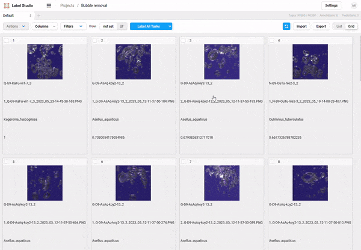

This document runs through the process of outlier detection. Outliers are for example bubbles, forceps or other images we want to get rid of from the dataset. The process is done by comparing the images to each other and finding the most different ones. 

## Dataset exploration
The process begins in the `taxonomist-studio dataset explore`. An easy way to find outliers is to
plot the samples in a scatter plot based on their area difference. By grouping samples by
individual and setting the x-axis aggregation function as "mean" and the y-axis aggregation
function as `lambda x: x.max()-x.min()/x.mean()`, we can find the most different samples:


The individuals marked in red are most probably outliers. The next step is to find and annotate these samples.

Let's first inspect the individual `Q-G9-KaFu-vii1-7` that we find by hovering over the plot. Note that hover columns are set to `individual`.


We will search the dataset for individual:


Clicking "Load a batch of images" will load the images, and we can see from the total of 52 images that there are some bubbles:


We could go to the file directory and delete the three images, but a more convenient way is to search for all similar images and annotate them.

## Outlier annotation
First, we want to find the filename of a query image that is used as the starting point for the search. In our case we have a bubble image from the previous step, and we can find the image from the dataset directory.

In order to perform the similarity search, feature extraction has to be done. This can be done with the `taxonomist-studio embedder` command. The feature vectors are saved in a Parquet file that is uploaded in the 'Similarity search' tab.


After image selection and clicking "Load a batch of images", the (64 by default) most similar images are shown. We can see that there are much more bubble images than the three we found earlier.


Finally, by clicking "Export to Label Studio csv" we can download a csv file that is ordered by the similarity to the query image. The csv file can be uploaded to Label Studio for annotation. In this example we will save the file as `label_studio_bubbles.csv`.

<details open>
<summary>Setting the host</summary>
Label Studio expects images to be passed as urls. As the dataset is saved usually locally and not on the cloud, we have to start a server that serves the images. This can be done with the `taxonomist-studio serve-dataset` command. By default the server is started at `http://localhost:5000`, but in other cases the host and port can be set with the `--host` and `--port` flags. The host and port must match the csv file that is uploaded to Label Studio, and the host and port can be set in the 'Host' field above the 'Export to Label Studio csv' button.
</details>

## Label Studio

You can start a new Anaconda prompt and start a Label Studio session by running
```bash
taxonomist-studio labelstudio --data_folder <folder_to_your_data> --csv_path <location_of_your_metadata_csv> --species_level
```
The `--species_level` flag is used if the directory structure is `data_folder/species/individual/imaging_run/image.jpg`. The `--species_level` flag is not needed if the directory structure is `data_folder/individual/imaging_run/image.jpg`.

If you have not used Label Studio before, you have set up an account. This account is used only for the local annotations.


Once in Label Studio, start "Create Project", name the project and select the exported csv on the "Data Import" tab. In our case the file was named as `label_studio_bubbles.csv`. The data is imported as a "List of tasks".


Once the data is imported, the labeling setup has to be specified. In our case we want to create a binary classification to bubbles and not bubbles. We will select "Image Classification" task, remove the default choices and add a new choice "Remove".

> [!IMPORTANT]
> The images are fetched from the server that was started with `taxonomist-studio serve-dataset`. The image field is `url` and has to be specified in the data configuration. The default `$image` has to be thus changed to `$url`.


Once we have our dataset in grid view, we can label the first instance of the dataset and note down the annotation ID (in our case 51). This ID is used when propagating annotations to other selected images. 




Then, we can select all images that match this annotation. In our case the first ones are all bubbles, but this might not always be the case. We will select them and select "Propagate annotation" and input the annotation ID we noted earlier.


Finally, once the annotations are done, we can export the annotations as a csv file using "Export". This file can be used to remove the images from the dataset during preprocessing.
